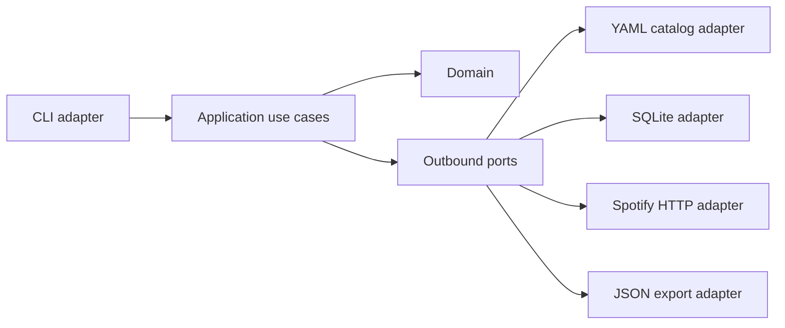

# Architecture

Spot Wu Family v2 is being rebuilt as a hexagonal Go application.

Current phase:

- Domain contains editorial artist catalog rules.
- Application contains `artists validate` and `artists import-groups`.
- YAML is an outbound adapter.
- CLI composition lives at the inbound edge.

Planned phases add Spotify, SQLite, export, Hugo and automation without making domain packages depend on those technologies.
