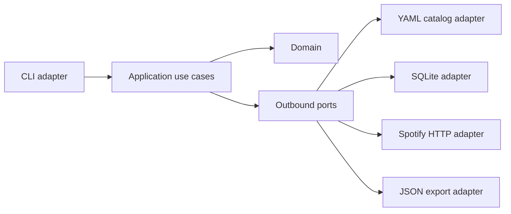

# Architecture

Spot Wu Family v2 is a hexagonal Go application that collects Spotify catalog data into versioned SQLite, exports deterministic JSON and builds a static Hugo site.

Boundaries:

- Domain contains editorial artist catalog rules, media concepts and artist candidate scoring.
- Application contains explicit use cases for artist validation/import/resolution, catalog sync and catalog export.
- YAML is an outbound adapter.
- Local JSON candidate files are an outbound adapter for offline resolution reports.
- Spotify is an outbound `net/http` adapter behind candidate-search and catalog-fetching ports.
- SQLite is an outbound `database/sql` adapter with versioned migrations, verification and deterministic snapshots.
- `catalogsync` is the sync use case: it depends on catalog YAML, a Spotify-facing fetcher port and a SQLite-facing repository port.
- `catalogexport` reads SQLite through an export reader port and writes deterministic JSON through a filesystem writer port.
- Hugo builds the static site from `site/`, reading generated JSON data and a static search index.
- CLI composition lives at the inbound edge.

The domain and application packages do not import Spotify, SQLite, YAML, JSON filesystem code, Hugo or GitHub Actions. Technology-specific wiring stays in the CLI and outbound adapters.
