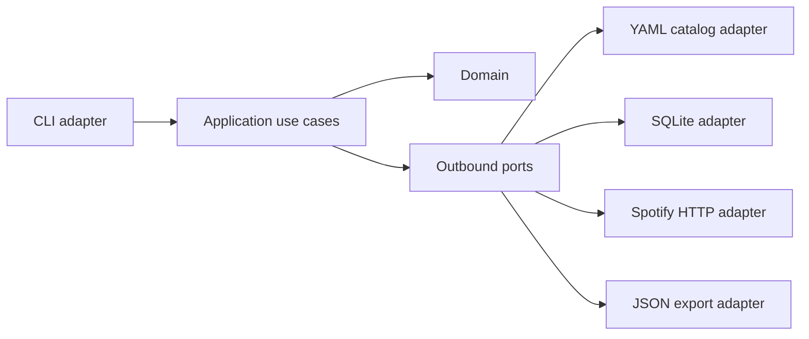

# Architecture

Spot Wu Family v2 is being rebuilt as a hexagonal Go application.

Current phase:

- Domain contains editorial artist catalog rules.
- Domain contains artist candidate scoring for resolution.
- Application contains `artists validate`, `artists import-groups` and non-interactive `artists resolve` reports.
- YAML is an outbound adapter.
- Local JSON candidate files are a temporary outbound adapter for offline resolution reports.
- Spotify is an outbound `net/http` adapter behind the candidate-search port and exposes catalog-fetching methods for later sync work.
- SQLite is an outbound `database/sql` adapter with versioned migrations, verification and deterministic snapshots.
- `catalogsync` is the sync use case: it depends on catalog YAML, a Spotify-facing fetcher port and a SQLite-facing repository port.
- CLI composition lives at the inbound edge.

Planned phases add Spotify, SQLite, export, Hugo and automation without making domain packages depend on those technologies.
